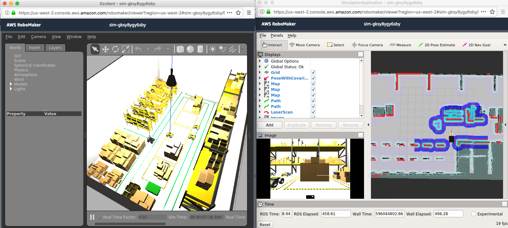
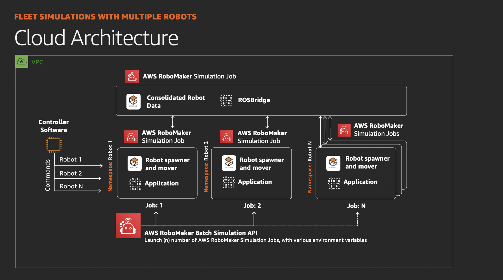

# Robot fleet simulation using concurrent gazebo instances

robot_fleet rospackage within this repo enables co-ordination between multiple [gazebo](http://gazebosim.org/tutorials?tut=ros_overview) instances to simulate a fleet of robots. We can compound this further by having multiple robots within same simulation as mentioned [here](https://answers.ros.org/question/41433/multiple-robots-simulation-and-navigation/). However, this current version expects a single robot with physics in each simulation, and uses [rosbridge](http://wiki.ros.org/rosbridge_suite) server/clients to communicate between the simulation instances.

## Requirements
* [ROS Melodic](http://wiki.ros.org/melodic) - Other ROS versions have not been tested.
* [Colcon](https://colcon.readthedocs.io) - Tested on colcon. catkin confirmed working on melodic only.
* [Gazebo9](http://gazebosim.org/blog/gazebo9) - Gazebo simulator.
* [Colcon bundle](https://github.com/colcon/colcon-bundle) - Enables packaging the application for running on RoboMaker.
* [boto3](https://docs.aws.amazon.com/cli/latest/userguide/cli-chap-install.html) - AWS SDK for Python
* [awscli](https://docs.aws.amazon.com/cli/latest/userguide/cli-chap-install.html) - AWS CLI setup on local machine with appropriate [credentials](https://docs.aws.amazon.com/cli/latest/userguide/cli-chap-configure.html)

## Usage

### Local Execution
This section is to run a single instace of the above application. This will NOT kick off multiple robots, but is a good way to see whats under the hood in this application. Has been testing on colcon/catkin on ROS Melodic, Ubuntu 18.04.
```
git clone https://github.com/aws-samples/multi-robot-fleet-sample-application.git
cd multi-robot-fleet-sample-application 
./setup/ros_setup.bash
```

Running this file performs
   * new rosdep definition for - roslibpy
   * rosdep update
   * wstool update - pulls in husky and aws-robomaker-small-warehouse-world repositories
   * Applies minor patches reqd to work with AWS RoboMaker
   * rosdep install -y —from-path <path_of_repos>
   * catkin build; source devel/setup.bash
   * source ./exports.sh

Set the appropriate environement variables required for the application in `exports.sh`
```
export ROBOT_NAME=server  # unique robot name
export ROSBRIDGE_STATE=SERVER  # SERVER or CLIENT
export ROSBRIDGE_IP=localhost  # localhost for SERVER. IP of rosbridge for CLIENT
export START_X=0  # start location of robot
export START_Y=0
export START_YAW=0
export HUSKY_REALSENSE_ENABLED=true
export HUSKY_LMS1XX_ENABLED=true
export USE_CUSTOM_MOVE_OBJECT_GAZEBO_PLUGIN=true  # set to true if you use custom plugin to move robot. False uses regular gazebo rostopics
export GAZEBO_PLUGIN_PATH=/home/ubuntu/multi-robot-fleet-sample-application/simulation_ws/build/robot_fleet:$GAZEBO_PLUGIN_PATH
```

To see the application running on your local machine, run the following command.
```
source simulation_ws/devel/setup.bash
roslaunch robot_fleet robot_fleet_rosbridge.launch gui:=true
```

### Cloud Execution

To setup multi robot fleet simulation on your AWS account, run the following command **AFTER** running the **Local execution** section. The local ROS application need not be running for this.

```
./setup/aws_setup_sample.bash
```

Running this file performs

   * Deploying the cloudformation stack to setup the AWS environment
   * Creates and uploads the bundle file to AWS
   * Kicks off a lambda function to start the multi-robot-fleet on AWS
   * Picks the corresponding params for the simulations from setup/fleetLauncherApp/fleetLauncherLambda/event.json



*Figure 1. A multiple robot fleet running in AWS RoboMaker.*

#### Setting the parameters in the cloud-based simulation

To update the parameters, such as robot name (ROBOT) and starting positions, you can edit the event.json file at **fleetLaucherApp/fleetLauncherLambda/event.json**. 

Here is the example JSON:

```
{
    "robots": [
        {
            "name": "robot1",
            "environmentVariables": {
                "START_X": "2",
                "START_Y": "2",
                "START_YAW": "3.143",
                "HUSKY_REALSENSE_ENABLED": "true",
                "HUSKY_LMS1XX_ENABLED": "true",
                "USE_CUSTOM_MOVE_OBJECT_GAZEBO_PLUGIN":"true"
            },
            "packageName": "robot_fleet",
            "launchFile": "robot_fleet_rosbridge.launch"
        }
        ...
    ],
    "server": {
        "name": "SERVER",
        "environmentVariables": {
            "START_X": "0",
            "START_Y": "0",
            "START_YAW": "0",
            "HUSKY_REALSENSE_ENABLED": "true",
            "HUSKY_LMS1XX_ENABLED": "true",
            "USE_CUSTOM_MOVE_OBJECT_GAZEBO_PLUGIN":"true"
        },
        "packageName": "robot_fleet",
        "launchFile": "robot_fleet_rosbridge.launch"
      }
  }
```

There are a group of optional attributes you can set if a ROSBridge server is already running or you want to customize the application details.

```
  "serverIP": "<ALREADY_RUNNING_ROSBRIDGE_SERVER>",
  "simulationJobParams": {
      "vpcConfig": {
          "subnets": [],
          "securityGroups": []
      },
      "iamRole": "<PRECREATED_IAM_ROLE>",
      "outputLocation": {
          "s3Bucket": "",
          "s3Key": ""
      }
  },
  "simulationApplicationArn": "<PRECREATED_SIMULATION_APPLICATION>"
```

#### Serverless Application Deployment

If you want to run the simulation launcher lambda function in AWS and link to an automated testing workflow, follow the README instructions [here](setup/fleetLauncherApp/README.md).

## How it works

* One gazebo instance acts as rosbridge_server and others as rosbridge clients
* We use rosbridge to pass current position information of robots in all gazebo instances
* For all other gazebo instances, we dynamically create and remove static robot models that represent the robot running its actual environment. We use gazebo plugin to move the static model in sync with its actual position information that we gather from rosbridge
* With RoboMaker, its easy to spin up the simulation with ROSBRIGE_SERVER, wait for its IP and pass that along for rest of CLIENT robots.

## Architecture




## Workshop for the Application

Follow the workshop built around this application by visiting our [workshop page](https://stage.robomakerworkshops.com/ws/multi_robot_fleet_simulations)

## Known issues

This package does not perform time synchronization, and simulation update lockstep between gazebo instances. Best results have been seen with homogeneous software stacks running on the gazebo instances.

## Security

See [CONTRIBUTING](CONTRIBUTING.md#security-issue-notifications) for more information.

## License

This library is licensed under the MIT-0 License. See the LICENSE file.

